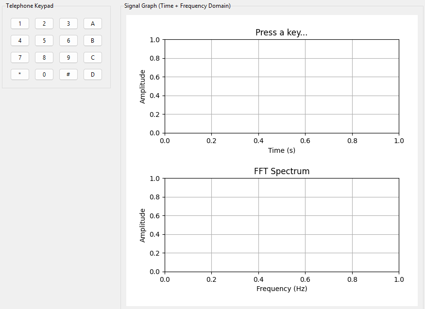

# COE 216 — Signals and Systems
## Homework 1 Report

**Course:** COE 216 Signals and Systems
**Semester:** 2025–2026 Spring
**Group Number:** 9

| Name | Student ID |
|------|-----------|
| Mustafa Talha Akgül | 230611043 |
| Ahmet Akın | 230611038 |
| Berivan Demir | 230611038 |

---

## Introduction

This report documents the design and implementation of two signal processing tasks completed as part of COE 216 — Signals and Systems. Task 1 investigates the discrete-time representation of sinusoidal signals at different frequencies and demonstrates the practical implications of the Nyquist–Shannon Sampling Theorem. Task 2 extends this foundation to a real-world application: the synthesis and interactive generation of DTMF (Dual-Tone Multi-Frequency) tones used in telephone systems, accompanied by a graphical user interface and frequency-domain analysis via the Fast Fourier Transform.

---

## 1. Method and Mathematical Model

### 1.1 Fundamental Frequency (f₀)

Each group derives its fundamental frequency f₀ by summing the last two digits of each member's student ID. For Group 9:

| Member | Student ID | Last Two Digits |
|--------|-----------|----------------|
| Mustafa Talha Akgül | 230611**043** | 43 |
| Ahmet Akın | 230611**038** | 38 |
| Berivan Demir | 230611**030** | 30 |

$$f_0 = 43 + 38 + 30 = 111 \text{ Hz}$$

The three signal frequencies derived from f₀ are:

| Signal | Definition | Value |
|--------|-----------|-------|
| f₁ | f₀ | 111 Hz |
| f₂ | f₀ / 2 | 55.5 Hz |
| f₃ | 10 × f₀ | 1110 Hz |

---

### 1.2 Nyquist–Shannon Sampling Theorem

The Nyquist–Shannon Sampling Theorem establishes the minimum sampling rate required for lossless discrete representation of a continuous-time signal. For a signal bandlimited to f_max, the sampling frequency f_s must satisfy:

$$f_s > 2 \cdot f_{max}$$

Violation of this condition results in **aliasing**, where high-frequency components fold back into the spectrum and become indistinguishable from lower-frequency components, permanently corrupting the signal.

**Task 1 — Justification:**

The highest frequency in Task 1 is f₃ = 1110 Hz. The Nyquist minimum is therefore:

$$f_s > 2 \times 1110 = 2220 \text{ Hz}$$

A sampling frequency of **f_s = 44100 Hz** (the CD audio standard) was selected. This exceeds the minimum by a factor of approximately 20, providing substantial margin against aliasing and ensuring clean reconstruction of all three signals:

$$\frac{44100}{2220} \approx 19.9 \quad \Rightarrow \quad f_s \gg f_{Nyquist} \checkmark$$

**Task 2 — Justification:**

The DTMF standard defines column frequencies up to 1633 Hz. The Nyquist criterion requires:

$$f_s > 2 \times 1633 = 3266 \text{ Hz}$$

The same 44100 Hz standard was adopted, satisfying the criterion by a factor greater than 13× and ensuring faithful reproduction of all 16 DTMF tones.

---

### 1.3 DTMF Signal Model

DTMF (Dual-Tone Multi-Frequency) is the signaling standard used by touch-tone telephone systems. Each key is uniquely encoded as the superposition of exactly two sinusoidal components — one drawn from a set of four row frequencies and one from a set of four column frequencies. This two-tone design allows unambiguous key identification and resistance to voice interference.

The continuous-time model of a DTMF signal for a given key is:

$$x(t) = \sin(2\pi f_{row} \cdot t) + \sin(2\pi f_{col} \cdot t), \quad 0 \leq t \leq T$$

To prevent digital clipping at the output stage (where the sum of two unit-amplitude sinusoids reaches a peak amplitude of 2), the signal is normalized:

$$x_{norm}(t) = 0.5 \cdot x(t) \quad \Rightarrow \quad x_{norm}(t) \in [-1,\ 1]$$

**Standard DTMF Frequency Table (ITU-T Q.23):**

|  | **1209 Hz** | **1336 Hz** | **1477 Hz** | **1633 Hz** |
|--|:-----------:|:-----------:|:-----------:|:-----------:|
| **697 Hz** | 1 | 2 | 3 | A |
| **770 Hz** | 4 | 5 | 6 | B |
| **852 Hz** | 7 | 8 | 9 | C |
| **941 Hz** | \* | 0 | \# | D |

The implementation uses f_s = 44100 Hz with a tone duration of T = 0.5 s per keypress, yielding N = 44100 × 0.5 = 22050 samples per tone.

---

## 2. Results

### 2.1 Task 1 — Individual Signal Subplots

The figure below shows three separate subplots for f₁, f₂, and f₃. Each time axis spans four complete periods of the respective signal, making the frequency contrast clearly visible: f₃ at 1110 Hz completes its cycles roughly ten times faster than f₁, while f₂ at 55.5 Hz oscillates at the slowest rate.


*Figure 1: Sampled sinusoidal signals at f₁ = 111 Hz, f₂ = 55.5 Hz, and f₃ = 1110 Hz. Each subplot spans 4 full periods at f_s = 44100 Hz.*

---

### 2.2 Task 1 — Combined Signal

The combined signal x(t) = sin(2πf₁t) + sin(2πf₂t) + sin(2πf₃t) is displayed below over a time window equal to four periods of the slowest component (f₂). The rapid oscillations of f₃ are embedded within the slower envelope shaped by f₁ and f₂, producing a complex yet periodic waveform characteristic of multi-component signals.


*Figure 2: Superposition of all three signals over four periods of f₂. The amplitude modulation pattern reflects the beating effect between the three frequency components.*

---

### 2.3 Task 2 — DTMF Generator Interface

The interactive application presents a standard 4×4 telephone keypad on the left side. The right panel displays the signal graph, which updates in real time upon each keypress. Before any key is pressed, the graph area is empty and awaits input.



*Figure 3: Initial state of the DTMF Signal Generator GUI. The Tkinter-based interface displays the full 16-key keypad alongside the signal visualization panel.*

---

### 2.4 Task 2 — Time-Domain Waveform and FFT Spectrum

When a key is pressed, the application simultaneously plays the corresponding DTMF tone and renders two plots: the time-domain waveform (showing the first 20 ms of the signal for legibility) and the FFT magnitude spectrum. The frequency-domain plot confirms the two-component nature of the signal — exactly two sharp spectral peaks are visible, located precisely at the row and column frequencies of the pressed key. This serves as empirical verification of correct DTMF synthesis.


*Figure 4: Live signal output after a keypress. The upper plot shows the composite time-domain waveform; the lower plot shows the FFT magnitude spectrum with vertical markers at f_row and f_col, confirming the presence of exactly two dominant frequency components.*

---

## 3. GitHub Repository

**Repository:** [github.com/mustafa-akgul/signal_system_H1](https://github.com/mustafa-akgul/signal_system_H1)

### Setup Instructions

```bash
git clone https://github.com/mustafa-akgul/signal_system_H1.git
cd signal_system_H1
pip install numpy matplotlib sounddevice
python task1.py   # Task 1
python task2.py   # Task 2
```

---

## 4. References

1. Oppenheim, A. V., & Schafer, R. W. (2010). *Discrete-Time Signal Processing* (3rd ed.). Prentice Hall.
2. ITU-T Recommendation Q.23 — *Technical Features of Push-Button Telephone Sets*.
3. NumPy FFT Documentation: https://numpy.org/doc/stable/reference/routines.fft.html
4. Matplotlib Documentation: https://matplotlib.org/stable/contents.html
5. SoundDevice Library: https://python-sounddevice.readthedocs.io/
6. Tkinter Reference (Python 3 Standard Library): https://docs.python.org/3/library/tkinter.html
7. Claude (Anthropic) — AI assistant consulted during development: https://claude.ai

---

## 5. Division of Labor

**Mustafa Talha Akgül — 230611043**
Led the testing and validation phase for both tasks, verifying signal correctness and GUI behavior across different inputs. Authored the project report, including the mathematical model section, figure captions, and references.

**Ahmet Akın — 230611038**
Responsible for the complete software implementation of Task 1 and Task 2 — covering sinusoidal signal generation, DTMF synthesis logic, Tkinter GUI layout, real-time FFT integration, and overall technical architecture of the project.

**Berivan Demir — 230611038**
Prepared and delivered the project presentation, synthesizing the theoretical background, implementation approach, and experimental results into a cohesive narrative for the group submission.
